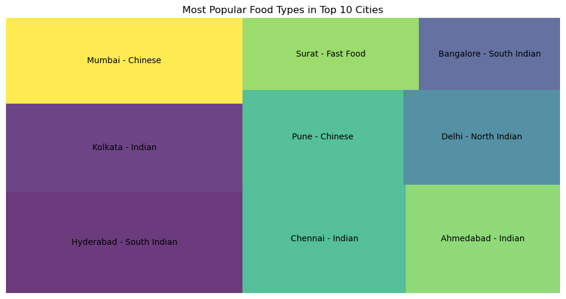

Swiggy Restaurant Analysis Notebook


```python
import pandas as pd 
import numpy as np
import seaborn as sns
import plotly.express as px
import matplotlib.pyplot as plt
import plotly.express as px
import plotly.graph_objects as go
import squarify
```


```python
df = pd.read_csv("swiggy.csv")
```


```python
df.head(10)
```


<div>
<style scoped>
    .dataframe tbody tr th:only-of-type {
        vertical-align: middle;
    }

    .dataframe tbody tr th {
        vertical-align: top;
    }

    .dataframe thead th {
        text-align: right;
    }
</style>
<table border="1" class="dataframe">
  <thead>
    <tr style="text-align: right;">
      <th></th>
      <th>ID</th>
      <th>Area</th>
      <th>City</th>
      <th>Restaurant</th>
      <th>Price</th>
      <th>Avg ratings</th>
      <th>Total ratings</th>
      <th>Food type</th>
      <th>Address</th>
      <th>Delivery time</th>
    </tr>
  </thead>
  <tbody>
    <tr>
      <th>0</th>
      <td>211</td>
      <td>Koramangala</td>
      <td>Bangalore</td>
      <td>Tandoor Hut</td>
      <td>300.0</td>
      <td>4.4</td>
      <td>100</td>
      <td>Biryani,Chinese,North Indian,South Indian</td>
      <td>5Th Block</td>
      <td>59</td>
    </tr>
    <tr>
      <th>1</th>
      <td>221</td>
      <td>Koramangala</td>
      <td>Bangalore</td>
      <td>Tunday Kababi</td>
      <td>300.0</td>
      <td>4.1</td>
      <td>100</td>
      <td>Mughlai,Lucknowi</td>
      <td>5Th Block</td>
      <td>56</td>
    </tr>
    <tr>
      <th>2</th>
      <td>246</td>
      <td>Jogupalya</td>
      <td>Bangalore</td>
      <td>Kim Lee</td>
      <td>650.0</td>
      <td>4.4</td>
      <td>100</td>
      <td>Chinese</td>
      <td>Double Road</td>
      <td>50</td>
    </tr>
    <tr>
      <th>3</th>
      <td>248</td>
      <td>Indiranagar</td>
      <td>Bangalore</td>
      <td>New Punjabi Hotel</td>
      <td>250.0</td>
      <td>3.9</td>
      <td>500</td>
      <td>North Indian,Punjabi,Tandoor,Chinese</td>
      <td>80 Feet Road</td>
      <td>57</td>
    </tr>
    <tr>
      <th>4</th>
      <td>249</td>
      <td>Indiranagar</td>
      <td>Bangalore</td>
      <td>Nh8</td>
      <td>350.0</td>
      <td>4.0</td>
      <td>50</td>
      <td>Rajasthani,Gujarati,North Indian,Snacks,Desser...</td>
      <td>80 Feet Road</td>
      <td>63</td>
    </tr>
    <tr>
      <th>5</th>
      <td>254</td>
      <td>Indiranagar</td>
      <td>Bangalore</td>
      <td>Treat</td>
      <td>800.0</td>
      <td>4.5</td>
      <td>100</td>
      <td>Mughlai,North Indian</td>
      <td>100 Feet Road</td>
      <td>56</td>
    </tr>
    <tr>
      <th>6</th>
      <td>258</td>
      <td>Indiranagar</td>
      <td>Bangalore</td>
      <td>Chinita Real Mexican Food</td>
      <td>1000.0</td>
      <td>4.5</td>
      <td>500</td>
      <td>Mexican,Beverages,Salads</td>
      <td>Double Road</td>
      <td>53</td>
    </tr>
    <tr>
      <th>7</th>
      <td>263</td>
      <td>Koramangala</td>
      <td>Bangalore</td>
      <td>Cupcake Noggins - Cakespastries And Desserts</td>
      <td>150.0</td>
      <td>4.3</td>
      <td>100</td>
      <td>Desserts,British,Bakery,Pizzas,Snacks</td>
      <td>4Th Block</td>
      <td>57</td>
    </tr>
    <tr>
      <th>8</th>
      <td>267</td>
      <td>Domlur</td>
      <td>Bangalore</td>
      <td>Tea Brew</td>
      <td>350.0</td>
      <td>4.1</td>
      <td>100</td>
      <td>American,Italian,Beverages,Continental,Chinese...</td>
      <td>Double Road</td>
      <td>57</td>
    </tr>
    <tr>
      <th>9</th>
      <td>308</td>
      <td>Koramangala</td>
      <td>Bangalore</td>
      <td>Bangaliana</td>
      <td>300.0</td>
      <td>4.0</td>
      <td>500</td>
      <td>Bengali</td>
      <td>7Th Block</td>
      <td>57</td>
    </tr>
  </tbody>
</table>
</div>


```python
df.describe
```


    <bound method NDFrame.describe of           ID                    Area       City                Restaurant  \
    0        211             Koramangala  Bangalore               Tandoor Hut   
    1        221             Koramangala  Bangalore             Tunday Kababi   
    2        246               Jogupalya  Bangalore                   Kim Lee   
    3        248             Indiranagar  Bangalore         New Punjabi Hotel   
    4        249             Indiranagar  Bangalore                       Nh8   
    ...      ...                     ...        ...                       ...   
    8675  464626  Panjarapole Cross Road  Ahmedabad                Malt Pizza   
    8676  465835                  Rohini      Delhi  Jay Mata Ji Home Kitchen   
    8677  465872                  Rohini      Delhi      Chinese Kitchen King   
    8678  465990                  Rohini      Delhi    Shree Ram Paratha Wala   
    8679  466488             Navrangpura  Ahmedabad              Sassy Street   
    
          Price  Avg ratings  Total ratings  \
    0     300.0          4.4            100   
    1     300.0          4.1            100   
    2     650.0          4.4            100   
    3     250.0          3.9            500   
    4     350.0          4.0             50   
    ...     ...          ...            ...   
    8675  500.0          2.9             80   
    8676  200.0          2.9             80   
    8677  150.0          2.9             80   
    8678  150.0          2.9             80   
    8679  250.0          2.9             80   
    
                                                  Food type       Address  \
    0             Biryani,Chinese,North Indian,South Indian     5Th Block   
    1                                      Mughlai,Lucknowi     5Th Block   
    2                                               Chinese   Double Road   
    3                  North Indian,Punjabi,Tandoor,Chinese  80 Feet Road   
    4     Rajasthani,Gujarati,North Indian,Snacks,Desser...  80 Feet Road   
    ...                                                 ...           ...   
    8675                                             Pizzas   Navrangpura   
    8676                                       South Indian        Rohini   
    8677                             Chinese,Snacks,Tandoor        Rohini   
    8678                         North Indian,Indian,Snacks        Rohini   
    8679                               Chaat,Snacks,Chinese   Navrangpura   
    
          Delivery time  
    0                59  
    1                56  
    2                50  
    3                57  
    4                63  
    ...             ...  
    8675             40  
    8676             28  
    8677             58  
    8678             28  
    8679             44  
    
    [8680 rows x 10 columns]>


```python
num_records = len(df)
num_records
```


    8680


```python
df.shape
```


    (8680, 10)


```python
price_range_counts = df['Price'].value_counts()
price_pie =px.pie(price_range_counts, names = price_range_counts.index, values= price_range_counts.values)
price_range_counts.head()

```


    Price
    300.0    1776
    200.0    1774
    250.0     968
    400.0     838
    500.0     605
    Name: count, dtype: int64


Data Analysis

#Correlation between Restaurant Price and Average Rating


```python
# Correlation between restaurant price and average rating
fig = px.scatter(df, x='Price', y='Avg ratings', title='Correlation between Restaurant Price and Average Rating', color_discrete_sequence=['red'])
fig.update_layout(template="plotly_dark")
fig.show()


```
- 


#Most Popular Food Types in Top 10 Cities


```python
# Group by 'City' and 'Food type', then count occurrences
city_food_counts = df.groupby(['City', 'Food type']).size().reset_index(name='Count')

# Find the most popular food type in each city
popular_food_types = city_food_counts.loc[city_food_counts.groupby('City')['Count'].idxmax()]

# Get the top 10 cities with the most popular food types
top_10_cities = popular_food_types.nlargest(10, 'Count')

# Prepare the data for the treemap
labels = top_10_cities['City'] + ' - ' + top_10_cities['Food type']
sizes = top_10_cities['Count']

# Create the treemap
import matplotlib.pyplot as plt
import squarify

plt.figure(figsize=(12, 6))
squarify.plot(sizes=sizes, label=labels, alpha=0.8)

plt.axis('off')
plt.title('Most Popular Food Types in Top 10 Cities')
plt.show()

                                            
```


    

    


Top 10 Cities ordering food from Swiggy 


```python
city_count = df["City"].value_counts()
top_n_cities = city_count.nlargest(10)
vis= px.pie(names=top_n_cities.index, values= top_n_cities.values, title = f'Top 10 Cities Ordering Food from Swiggy',labels={'City': 'City'}, width = 650, height= 650)
fig.update_layout(template="plotly_dark")
vis.show()
```


- 


```python
#Heat Map
```


```python
numeric_df = df.select_dtypes(include=[np.number])
correlation_matrix = numeric_df.corr()
fig = go.Figure(data=go.Heatmap(z=correlation_matrix, x=correlation_matrix.columns, y=correlation_matrix.columns,colorscale='Viridis') )
fig.update_layout(title='Correlation Heatmap of Factors Affecting Average Rating')
fig.show()
```


- 


